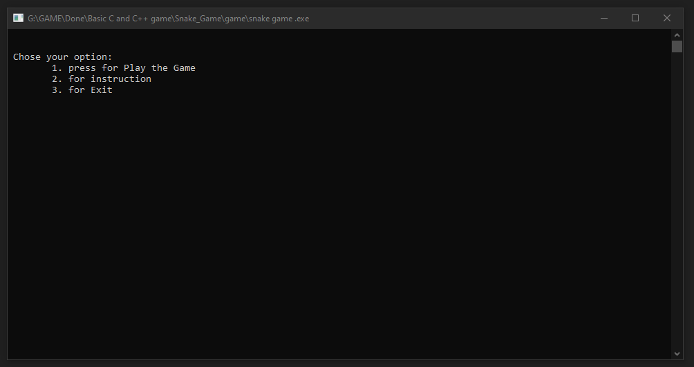

# Snake_Game

I always ownder with programming. Then I started to learn it. Semptember 2016, I start with c programming.
This game was made in 2017. This is my 1st poject on game that i have made after learing c.

## Project description
Name: Snake
Programming Language: C
Project No: 1

## Screen shot
Homescreen

## Authors

* **AbirHasan**

Check out my other works [@XAbirHasan](https://github.com/XAbirHasan)
