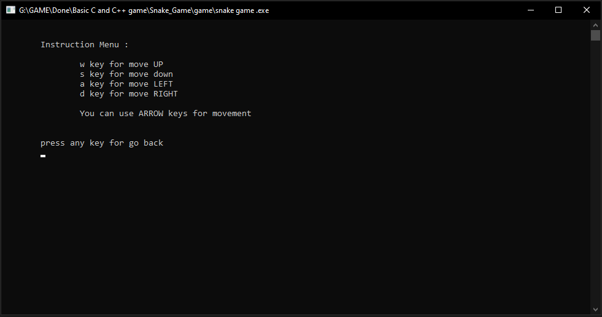
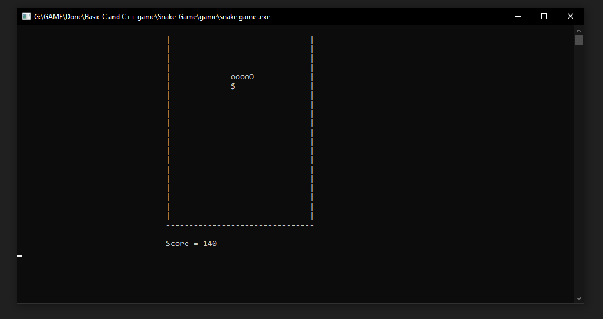
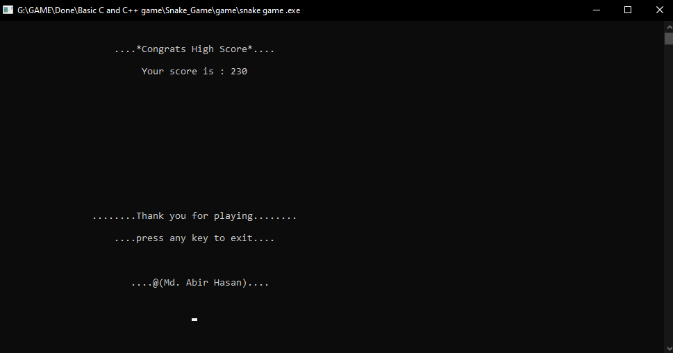

# Snake_Game

I always wonder with programming. Then I started to learn it. September 2016, I start with c programming.
This game was made in 2017. This is my 1st project on game that I have made after learning c.

## Project description
Name: Snake  
Programming Language: C  
Project No: 1  
Year: 2017

## Demo Video

## Screen shot
### Homescreen
 

### Instruction Page
 

### Game Window
 

### GameOver
 

## Authors

* **AbirHasan**

Check out my other works [@XAbirHasan](https://github.com/XAbirHasan)
